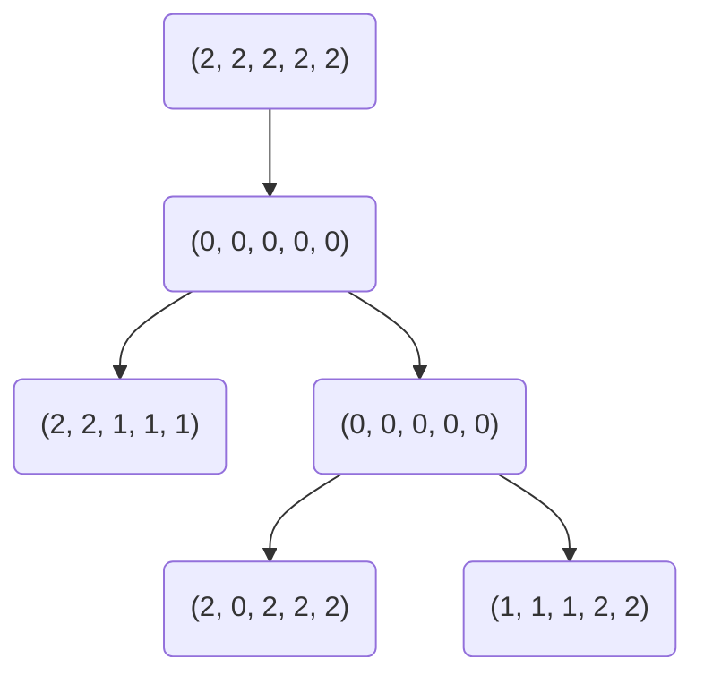

# cnphylogeny

**cnphylogeny** provides tools for phylogeny inference using copy number
aberrations. Phylogenies are represented as Markov random fields and optimized
with Gibbs sampling. **cnphylogeny** provides a C library and a CLI.

## Getting Started

To install the **cnphylogeny** CLI, run the following commands:

```
git clone https://github.com/jammathai/cnphylogeny.git
cd cnphylogeny
make
```

Running `make` should produce the following output:

```
mkdir build
cc -c -o build/cnphylogeny.o src/cnphylogeny.c
cc -c -o build/main.o src/main.c
cc -lm -o build/cnphylogeny build/cnphylogeny.o build/main.o
```

If desired, add `build/cnphylogeny` to `PATH`. Run `cnphylogeny -h` to print
usage information.

To use the **cnphylogeny** library, simply download
[`cnphylogeny.c`](src/cnphylogeny.c) and
[`cnphylogeny.h`](include/cnphylogeny.h) and add them to your C project. Since
**cnphylogeny** uses `<math.h>`, use the `-lm` flag during compilation.

## Examples

The following examples provide an introduction to the CLI. For library
documentation, see [`cnphylogeny.h`](include/cnphylogeny.h).

### Defining a Probability Matrix

Probability matrices must be square, right stochastic matrices. In other words,
the number of rows and columns must be equal and each row must sum to one. If
the maximum possible copy number is $n$, probability matrices must have order
$n + 1$. Probability matrices are stored as CSV files. For example, a mutation
probability matrix for copy numbers up to five might look like this:

```csv
1,0,0,0,0,0
0.0002,0.999,0.0002,0.0002,0.0002,0.0002
0.0002,0.0002,0.999,0.0002,0.0002,0.0002
0.0002,0.0002,0.0002,0.999,0.0002,0.0002
0.0002,0.0002,0.0002,0.0002,0.999,0.0002
0.0002,0.0002,0.0002,0.0002,0.0002,0.999
```

When running `cnphylogeny`, use `-m` flag to specify the mutation probability
matrix (default: [`mutation-probs.csv`](data/mutation-probs.csv)) and `-n` to
specify the neighbor probability matrix (default:
[`neighbor-probs.csv`](data/mutation-probs.csv)).

### Defining a Phylogeny

A phylogeny is defined by two files with the same basename:

- A CSV file that stores each node's CNP; for example, `my-phylogeny.csv`:

  ```csv
  2,2,2,2,2
  0,0,0,0,0
  2,2,1,1,1
  0,0,0,0,0
  2,0,2,2,2
  1,1,1,2,2
  ```

  This file must have a row for each phylogeny node.

- A [Newick (`.nwk`) file](https://en.wikipedia.org/wiki/Newick_format) that
  stores the phylogeny's structure; for example, `my-phylogeny.nwk`:

  ```nwk
  ((2,(4,5)3)1)0
  ```

  The node names in this file correspond to the rows of the associated CSV file
  (rows are zero-indexed). In this example, the root node (0) corresponds to the
  first row of `my-phylogeny.csv`, which stores the CNP $(2, 2, 2, 2, 2)$.

When running `cnphylogeny`, use the shared basename of these two files to refer
to the phylogeny. For example, `cnphylogeny my-phylogney` optimizes the
phylogeny defined above, which looks like this:



### Optimizing a Phylogeny

Running `cnphylogeny -h` prints the following usage message:

```
Usage: cnphylogeny [options] <phylogeny>

Arguments:
    <phylogeny>  The shared basename of the Newick file and CSV file that
                 define a phylogeny

Options:
    -b <int>        Number of burn-in samples (default: 1000000)
    -c <int>        Number of samples to record (default: 1000000)
    -h              Print this message and exit
    -m <csv>        Source mutation probabilities from the specified CSV file
                    (default: data/mutation-probs.csv)
    -n <csv>        Source neighbor probabilities from the specified CSV file
                    (default: data/neighbor-probs.csv)
    -o <phylogeny>  Write the optimized phylogeny to <phylogeny>.nwk and
                    <phylogeny>.csv (default: [YYYY]-[MM]-[DD]T[HH]:[MM]:[SS])
```

`cnphylogeny` prints the phylogeny before and after optimization. Since CNPs are
usually far too long to be human-readable, each node is printed in relation to
its parent. For example, consider a parent node and a child node with the
following CNPs:

| Parent            | Child             |
| :---------------: | :---------------: |
| $(0, 0, 0, 0, 0)$ | $(2, 2, 0, 1, 1)$ |

These CNPs can be broken up into two regions:

| Interval | Parent   | Child    | Mutation? |
| :------: | :------: | :------: | :-------: |
| $[0, 1]$ | $(0, 0)$ | $(2, 2)$ | Yes       |
| $[2, 2]$ | $(0)$    | $(0)$    | No        |
| $[3, 4]$ | $(0, 0)$ | $(1, 1)$ | Yes       |

This differences between these regions are printed:

```
[0,1]:0->2 [3,4]:0->1
```

The example phylogeny `my-phylogeny`, defined above, is printed like this:

```
- (Root)
  - [0,4]:2->0
   |- [0,1]:0->2 [2,4]:0->1
    - (Unchanged)
     |- [0,0]:0->2 [2,4]:0->2
      - [0,2]:0->1 [3,4]:0->2
```

We might optimize this phylogeny by running the following command:

```
cnphylogeny -b 10 -c 20 -o my-optimized-phylogeny my-phylogeny
```

This will optimize `my-phylogeny`, ignoring the first 10 iterations of Gibbs
sampling and subsequently recording 20 samples. The resulting phylogeny will be
written to `my-optimized-phylogeny.csv` and `my-optimized-phylogeny.nwk`. This
command should produce the following output:

```
my-phylogeny (before optimization):
- (Root)
  - [0,4]:2->0
   |- [0,1]:0->2 [2,4]:0->1
    - (Unchanged)
     |- [0,0]:0->2 [2,4]:0->2
      - [0,2]:0->1 [3,4]:0->2

my-optimized-phylogeny (after optimization):
- (Root)
  - (Unchanged)
   |- [2,4]:2->1
    - (Unchanged)
     |- [1,1]:2->0
      - [0,2]:2->1
```

## Thanks

Thanks to [Palash Sashittal](https://github.com/sashitt2) for guidance and
oversight.
