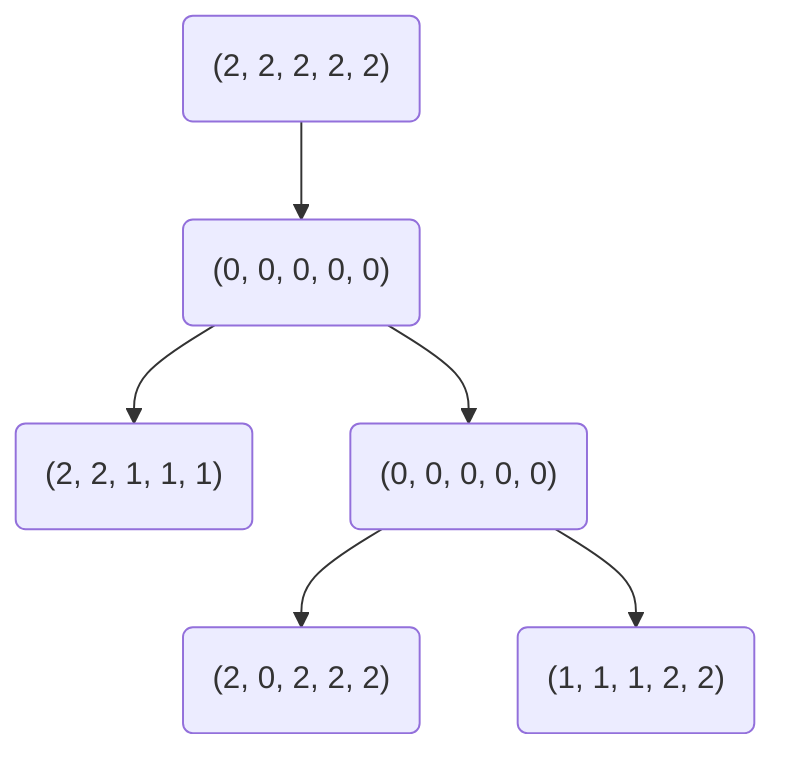

# cnphylogeny

**cnphylogeny** provides tools for phylogeny inference using copy number
aberrations. Phylogenies are represented as Markov random fields and optimized
with Gibbs sampling. **cnphylogeny** provides a C library and a CLI.

## Getting Started

To install the **cnphylogeny** CLI, run the following commands:

```
git clone https://github.com/jammathai/cnphylogeny.git
cd cnphylogeny
make
```

Running `make` should produce the following output:

```
mkdir build
cc -c -o build/cnphylogeny.o src/cnphylogeny.c
cc -c -o build/main.o src/main.c
cc -lm -o build/cnphylogeny build/cnphylogeny.o build/main.o
```

If desired, add `build/cnphylogeny` to `PATH`. Run `cnphylogeny -h` to print
usage information.

To use the **cnphylogeny** library, simply download
[`cnphylogeny.c`](src/cnphylogeny.c) and
[`cnphylogeny.h`](include/cnphylogeny.h) and add them to your C project. Since
**cnphylogeny** uses `<math.h>`, use the `-lm` flag during compilation.

## Examples

The following examples provide an introduction to the CLI. For library
documentation, see [`cnphylogeny.h`](include/cnphylogeny.h).

### Defining a Probability Matrix

Probability matrices must be square, right stochastic matrices. In other words,
the number of rows and columns must be equal and each row must sum to one. If
the maximum possible copy number is $n$, probability matrices must have order
$n + 1$. Probability matrices are stored as CSV files. For example, a mutation
probability matrix for copy numbers up to five might look like this:

```csv
1,0,0,0,0,0
0.0002,0.999,0.0002,0.0002,0.0002,0.0002
0.0002,0.0002,0.999,0.0002,0.0002,0.0002
0.0002,0.0002,0.0002,0.999,0.0002,0.0002
0.0002,0.0002,0.0002,0.0002,0.999,0.0002
0.0002,0.0002,0.0002,0.0002,0.0002,0.999
```

When running `cnphylogeny`, use `-m` flag to specify the mutation probability
matrix (default: [`mutation-probs.csv`](data/mutation-probs.csv)) and `-n` to
specify the neighbor probability matrix (default:
[`neighbor-probs.csv`](data/mutation-probs.csv)).

### Defining a Phylogeny

A phylogeny is defined by two files:

- A CSV file that stores each node's CNP; for example, `my-phylogeny.csv`:

  ```csv
  2,2,2,2,2
  0,0,0,0,0
  2,2,1,1,1
  0,0,0,0,0
  2,0,2,2,2
  1,1,1,2,2
  ```

  This file must have a row for each phylogeny node.

- A [Newick (`.nwk`) file](https://en.wikipedia.org/wiki/Newick_format) that
  stores the phylogeny's structure; for example, `my-phylogeny.nwk`:

  ```nwk
  ((2,(4,5)3)1)0
  ```

  The node names in this file correspond to the rows of the associated CSV file
  (rows are zero-indexed). In this example, the root node (0) corresponds to the
  first row of `my-phylogeny.csv`, which stores the CNP $(2, 2, 2, 2, 2)$.

`my-phylogeny.csv` and `my-phylogeny.nwk` define a phylogeny that looks like this:



### Optimizing a Phylogeny

Running `cnphylogeny -h` prints the following usage message:

```
Usage: cnphylogeny [options] <nwk> <csv>

Arguments:
    <nwk>  The Newick file containing the phylogeny structure
    <csv>  The CSV containing CNPs for each phylogeny node

Options:
    -h        Print this message and exit
    -m <csv>  Source mutation probabilities from the specified CSV file
              (default: data/mutation-probs.csv)
    -n <csv>  Source neighbor probabilities from the specified CSV file
              (default: data/mutation-probs.csv)
    -o <csv>  Write the optimized CNPs to the specified CSV file
              (default: [YYYY]-[MM]-[DD]T[HH]:[MM]:[SS].csv)
    -s <int>  Number of samples to record (default: 1000000)
```

We might optimize this phylogeny by running the following command:

```
cnphylogeny -c 20 -o optimized-phylogeny.csv my-phylogeny.nwk my-phylogeny.csv
```

This will optimize `my-phylogeny`, recording 20 samples. The resulting copy
number profiles will be written to `optimized-phylogeny.csv`.

## Thanks

Thanks to [Palash Sashittal](https://github.com/sashitt2) for guidance and
oversight.
