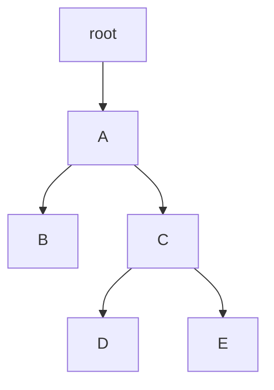

# cnphylogeny

**cnphylogeny** is a small C library for phylogeny inference using copy number
aberrations. Phylogenies are represented as Markov random fields and optimized
with Gibbs sampling.

## Getting Started

To use **cnphylogeny**, simply add `cnphylogeny.c` and `cnphylogeny.h` to your
project. Since **cnphylogeny** uses `<math.h>`, use the `-lm` flag during
compilation.

`cnphylogeny.h` contains detailed documentation in the form of docstrings. The
examples below provide the basic information to get started.

## Examples

Once you've included `cnphylogeny.h`, you must declare the global variables
`cnp_len`, `max_copy_num`, `neighbor_probs`, and `mutation_probs` in order to
compile successfully. For example:

```C
size_t cnp_len = 1000;
copy_num max_copy_num = 5;
double **neighbor_probs;
double **mutation_probs;
```

You must also use `prob_matrix_new()` to assign `neighbor_probs` and
`mutation_probs` before calling `phylogeny_optimize()`.

### Defining a Probability Matrix

`prob_matrix_new()` creates a new probability matrix. Note that probability
matrices must be square, right stochastic matrices. In other words, the number
of rows and columns must be equal and each row must sum to one. Create a
probability matrix like this:

```C
double **mutation_probs = prob_matrix_new((double []) {
    1, 0, 0, 0, 0, 0,
    0.002, 0.99, 0.002, 0.002, 0.002, 0.002,
    0.002, 0.002, 0.99, 0.002, 0.002, 0.002,
    0.002, 0.002, 0.002, 0.99, 0.002, 0.002,
    0.002, 0.002, 0.002, 0.002, 0.99, 0.002,
    0.002, 0.002, 0.002, 0.002, 0.002, 0.99,
});
```

The values of a probability matrix are stored as natural log probabilities.
Therefore, be careful when manually assigning the probabilities of an existing
matrix.

### Creating a Node

`cnp_node_new()` creates a binary tree node that stores a copy number profile
(CNP). Create a node with no children like this:

```C
struct cnp_node *node = cnp_node_new(
    NULL, // Left child
    NULL // Right child
);
```

Usually, you will want to set the new node's CNP data; for example:

```C
for (int i = 0; i < cnp_len; i++)
    node->bins[i] = /* Get a value */;
```

### Creating a Phylogeny

The simplest way to create a phylogeny is to use nested calls to
`cnp_node_new()` to define a tree structure, as shown below:

```C
struct cnp_node *root = cnp_node_new(
    cnp_node_new(
        cnp_node_new(NULL, NULL),
        cnp_node_new(
            cnp_node_new(NULL, NULL),
            cnp_node_new(NULL, NULL)
        )
    ),
    NULL
);
```

Note that, when a node has only one child, it should be the left child. This
allows us to assert that any node with no left child is a leaf node. The
phylogeny created in the example above looks like this:



### Optimizing a Phylogeny

Optimize a phylogeny using `phylogeny_optimize()` as shown:

```C
phylogeny_optimize(
    root,
    1000, // Ignore the first 1,000 iterations
    100, // Record every 100th iteration (after the first 1,000)
    50 // Stop after recording 50 iterations
);
```

`phylogeny_optimize()` uses Gibbs sampling to optimize the internal nodes of the
phylogeny (excluding the root). After sampling, the mode value for each bin is
selected. Be aware that `phylogeny_optimize()` modifies values in place.

## Thanks

Thanks to [Palash Sashittal](https://github.com/sashitt2) for guidance and
oversight.
